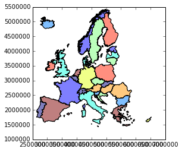
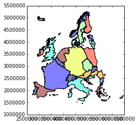

# cartogram_geopandas
v0.0.0b

Easy construction of continuous cartogram on a Polygon/MultiPolygon GeoDataFrame (modify the geometry in place or create a new GeoDataFrame).

Code adapted from Carson Farmer code *(https://github.com/carsonfarmer/cartogram : former code used in 'Cartogram' QGis python plugin)* to fit the geopandas.**GeoDataFrame** datastructure.  
Carson Farmer's code is partially related to 'pyCartogram.py' from Eric Wolfs.  
Algorithm itself based on :  
```Dougenik, J. A, N. R. Chrisman, and D. R. Niemeyer. 1985. "An algorithm to construct continuous cartograms." Professional Geographer 37:75-81```  

Early stage of developement / mainly untested. No warranty of any kind concerning the result.  

Installation
------------
```
$ git clone https://github.com/mthh/cartogram_geopandas.git
$ cd cartogram_geopandas/
$ python setup.py install
```
  
Usage
-----
```python
In [1]: import geopandas as gpd

In [2]: geodf = gpd.read_file('datasource.shp')

In [3]: from cartogram_geopandas import make_cartogram

In [4]: transformed_geodf = make_cartogram(geodf, 'Field_to_use', 4, inplace=False)

In [5]: geodf.plot()
Out[5]: <matplotlib.axes._subplots.AxesSubplot at 0x7fa76932f470>
```

```
In [6]: transformed_geodf.plot()
Out[6]: <matplotlib.axes._subplots.AxesSubplot at 0x7fa7478dba90>
```


  
Todo
----
- Probably a lot of things (properly handling crs, increasing computation speed, etc.)  
  
  
Copyright (C) 2015 mthh  
Copyright (C) 2013 Carson Farmer  
